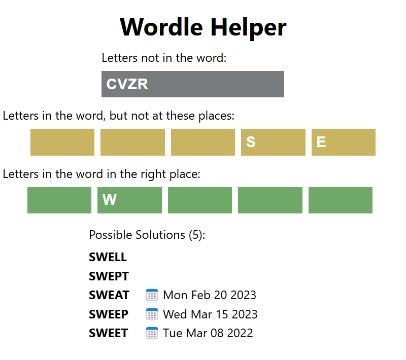

# Wordle Helper

Helps check for possible Wordle solutions and shows words that have already been solutions in the past.
Try it [here](https://juharris.github.io/wordle-helper/home).



To avoid spoilers, the page will not show if a words was a solution from the last few days.

Date sources:
* Past solutions:
  * https://www.fiveforks.com/wordle
* Possible solutions:
  * https://wordsrated.com/wordle-words
  * TODO: Need more.

# Development Notes
Built using a sample for Next.js + Jest.

This includes Next.js' built-in support for Global CSS, CSS Modules and TypeScript. This example also shows how to use Jest with the App Router and React Server Components.

> **Note:** Since tests can be co-located alongside other files inside the App Router, we have placed those tests in `app/` to demonstrate this behavior (which is different than `pages/`). You can still place all tests in `__tests__` if you prefer.

## Running Tests

```bash
npm test
```
